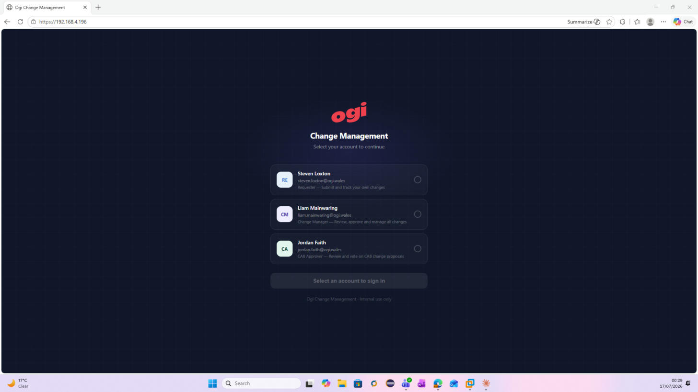
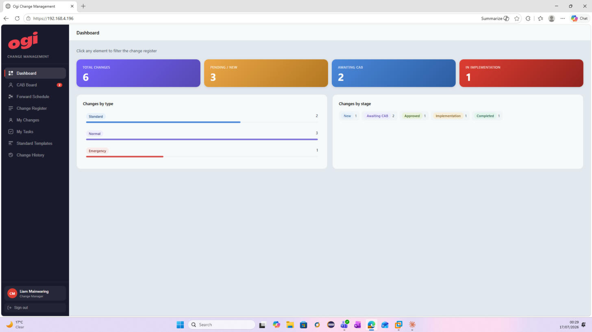
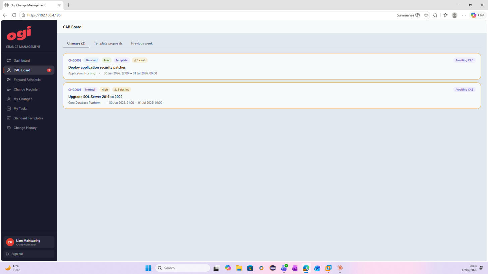
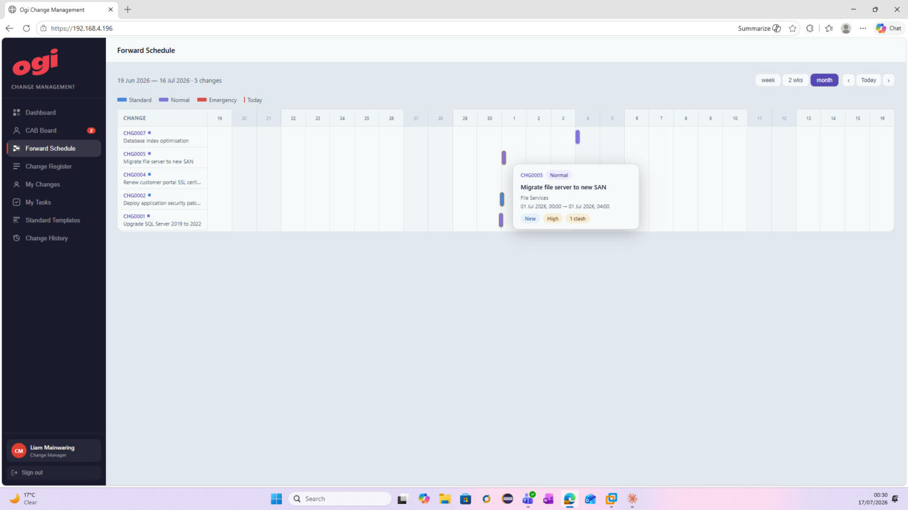
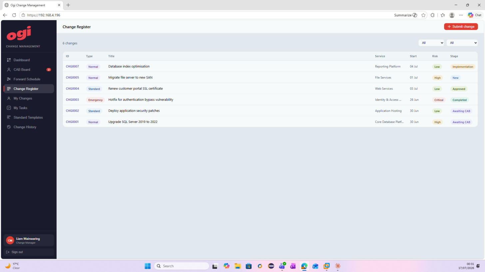
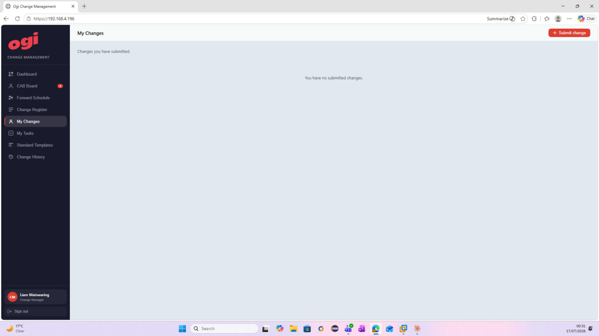
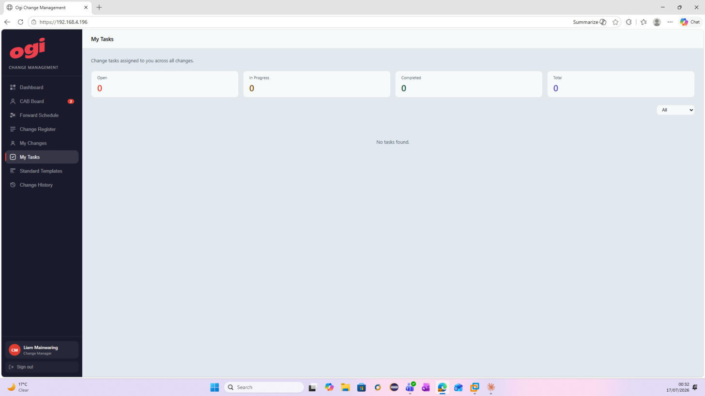
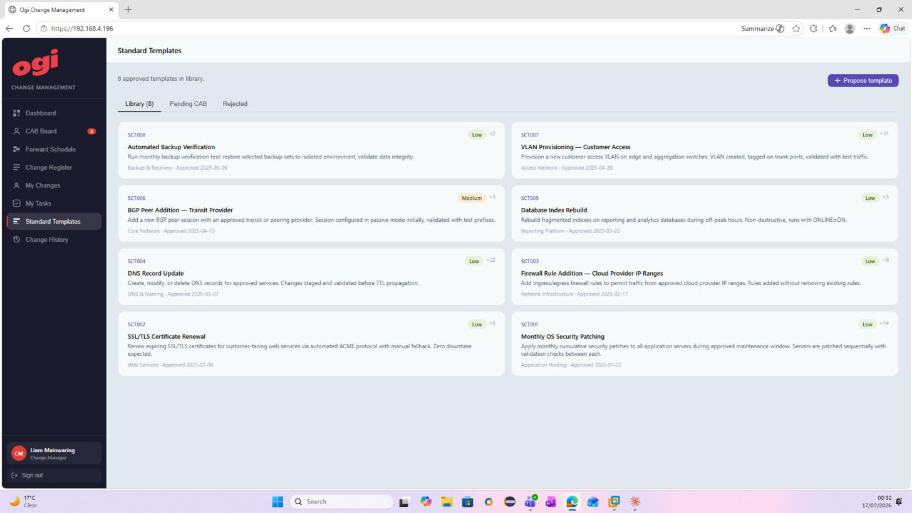
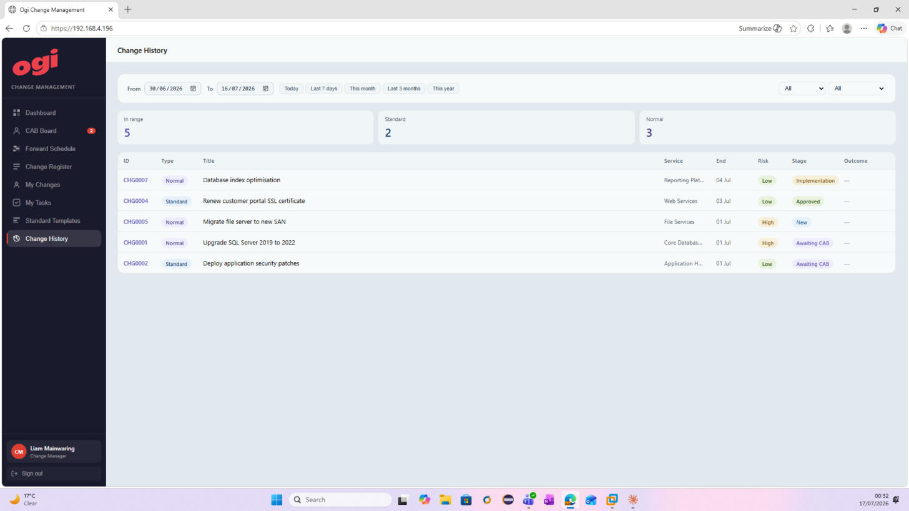

# Ogi Change Management

An ITIL-aligned change management application built for internal use at Ogi. Covers the full change lifecycle — from submission and CAB review through to implementation, post-implementation review, and closure — with role-based access for Requesters, Change Managers, and CAB Approvers.

---

## Tech Stack

| Layer | Technology |
|---|---|
| Frontend | React 18 + Vite |
| API | Node.js + Express |
| ORM | Prisma |
| Database | PostgreSQL |
| Reverse proxy | Nginx (TLS termination) |
| Process management | systemd |

---

## Architecture

```
Browser → Nginx :443 → React app (static dist/)
                    ↘ /api/* → Node.js :3001 → PostgreSQL
```

See [`deploy/architecture.svg`](deploy/architecture.svg) for a full diagram.

---

## User Roles

| Role | User | Permissions |
|---|---|---|
| Requester | Steven Loxton | Submit changes, track own changes and tasks |
| Change Manager | Liam Mainwaring | All of the above + advance stages, manage CAB schedule |
| CAB Approver | Jordan Faith | All of the above + vote Approve / Reject / Defer on CAB proposals |

> Authentication currently uses a demo role-picker. Azure Entra ID integration is planned — see `CLAUDE.md` for details.

---

## Screenshots

### Login



Select your account to sign in. Each account maps to a role which controls what actions are available within the app.

---

### Dashboard



At-a-glance summary of the current change portfolio. Stat cards show total changes, pending/new, awaiting CAB, and in implementation. Charts break down changes by type (Standard / Normal / Emergency) and by stage. Clicking any stat card filters the Change Register.

---

### CAB Board



Lists all changes currently awaiting CAB approval. Shows change type, risk level, clash warnings, and planned implementation window. CAB Approvers can vote Approve / Reject / Defer directly from this view. Tabs also surface pending template proposals and the previous week's decisions.

---

### Forward Schedule



SVG Gantt chart plotting all active changes across their planned implementation windows. Colour-coded by change type (Standard / Normal / Emergency). Clash detection flags overlapping changes. Supports week / 2-week / month zoom levels. Hovering a bar shows a tooltip with full change details.

---

### Change Register



Master list of all changes with ID, type, title, service, planned start, risk, and current stage. Filter by type or stage using the dropdowns. Click any row to open the full change detail panel. The **+ Submit change** button opens the new change request form.

---

### My Changes



Personal view filtered to changes submitted by the logged-in user. Provides quick access to track progress on your own submissions without scrolling through the full register.

---

### My Tasks



Shows all change tasks assigned to the logged-in user across all changes. Summary cards count Open, In Progress, and Completed tasks. Tasks can be filtered by status and updated directly from this view.

---

### Standard Templates



Library of pre-approved standard change templates. Each card shows the template ID, title, description, risk level, and usage count. Selecting a template when submitting a Standard change pre-populates the form fields. Change Managers can propose new templates; CAB Approvers approve or reject them via the Pending CAB tab.

---

### Change History



Time-bounded view of changes with date-range picker and quick-select presets (Today, Last 7 days, This month, Last 3 months, This year). Includes an Outcome column for completed changes. Filter by type or stage. Useful for reporting and post-incident review.

---

## Development Setup

### Prerequisites

- Node.js 18+
- PostgreSQL

### First-time setup

```bash
# 1. Install frontend dependencies
npm install

# 2. Install API dependencies and generate Prisma client
cd api
npm install

# 3. Create .env from example and set your DATABASE_URL
cp .env.example .env

# 4. Push schema to Postgres
npm run db:push

# 5. Seed with demo data
npm run db:seed
```

### Running locally

```bash
# Run frontend and API together
npm run dev:all

# Or separately:
npm run dev        # Vite dev server on :5173
npm run dev:api    # Express API on :3001
```

Vite proxies `/api/*` to `http://localhost:3001` in development.

---

## Deployment

The app is deployed on an Ubuntu server with Nginx as a reverse proxy and systemd managing the Node.js API process. See [`DEPLOY.md`](DEPLOY.md) for full deployment instructions covering:

- Node.js, Nginx, and PostgreSQL installation
- systemd service configuration
- Self-signed TLS certificate setup
- Nginx configuration
- Update workflow (git pull → npm install → build → restart)

---

## Data Model

Three Prisma models back the application:

- **Change** — the core record, includes type, stage, risk, CAB votes, tasks, and attachments
- **Task** — child records of a Change; cascade-deleted when the parent change is deleted
- **Template** — standard change templates with their own approval lifecycle

Change IDs are server-generated in the format `CHG0001`. Task IDs use `TASK0001`. Template IDs use `SCT001`.

---

## Planned Enhancements

- **Azure Entra ID authentication** — replace demo login with MSAL; map Entra app roles to Requester / Change Manager / CAB Approver
- **Azure deployment** — Azure Static Web Apps (frontend) + Azure App Service or Container Apps (API)
- **File attachments** — store in Azure Blob Storage, save URL reference in database
- **Email notifications** — notify requesters on stage changes and CAB decisions
